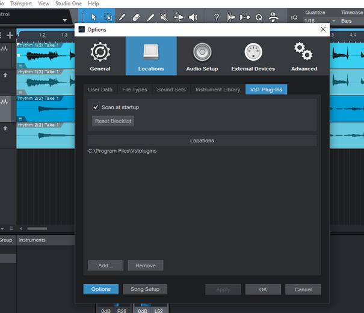
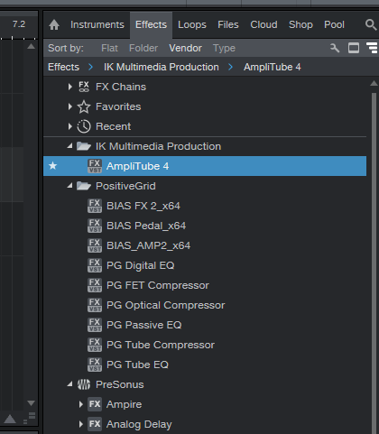
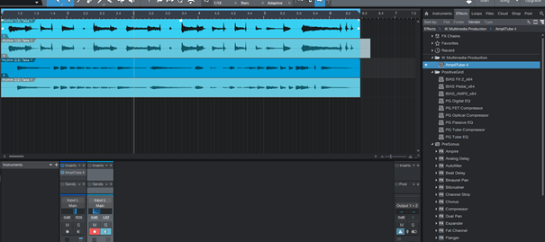
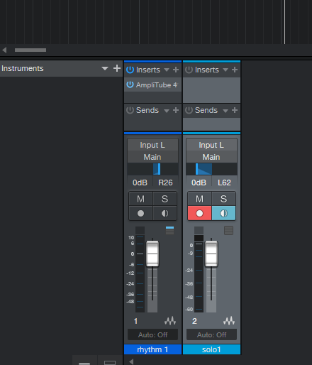
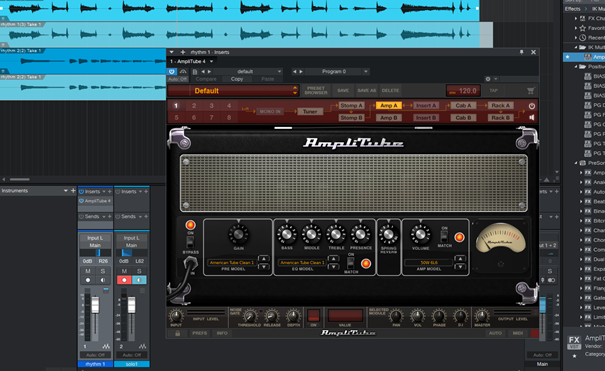

## **Embedding a 3rd party VST plug-in Studio One 5**

> To be able to use 3rd party plug-ins in Studio One 5 you need Artist version or higher.

To add 3rd party VST plug-ins go to Studio One > Options. A new window will pop up. Choose Locations and VST Plug-Ins tab. Provide the folder where you store your VSTs. Go back to the main window 

 

Go to the panel on the right. The available VST plug-ins are listed under Effects

 

Take the one you want to use, drag it and drop into the Inserts field of your track in Console view

 

You can see the embedded VST for each track in Console view

  

Your VST will pop up in a new window. Set it up for each track

 

