## **Layering multiple tracks in Studio One 5**

To add another take to the track, hit return and record again

 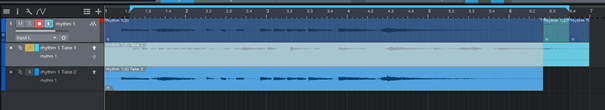

To choose which take should be active in the track click on the little hamburger menu at the beginning of each layer section

 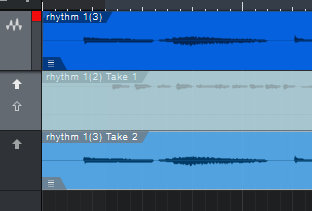

 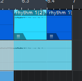

Switch off snap to grid to move tracks freely across the time axis or switch on to lock tracks with the predefined grid

 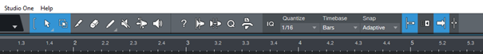

I prefer it off

 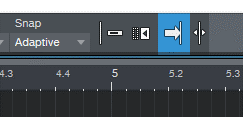

Time to add tracks. Hit T and arm the new track. Record a solo or a second rhythm track

 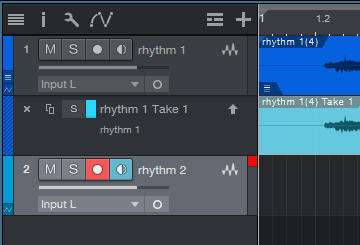

Recording is finished - time for panning – go to View and choose Console or hit F3

 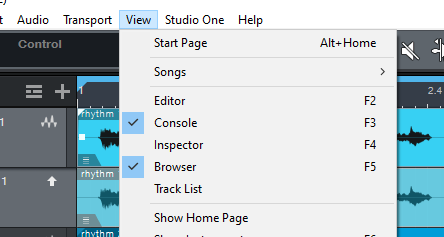

A new panel pops up

 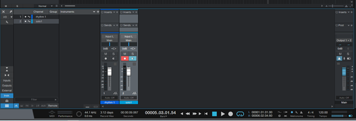

Move the blue sliders left, right or keep them centered. I panned my rhythm track a bit to the right and the solo to far left to give the part some aural depth

 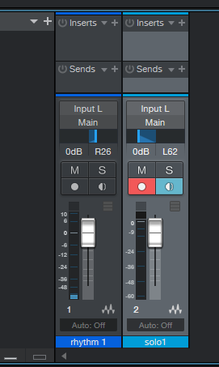

The main window is getting busier

 

To use a solo that extends beyond one loop repeat, simply duplicate the track, it will automatically place itself next to the existing track.

 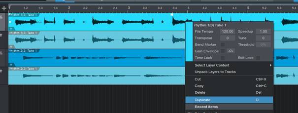

Then you can add another solo track to accompany your duplicated loop and choose the solo layer you want to use.

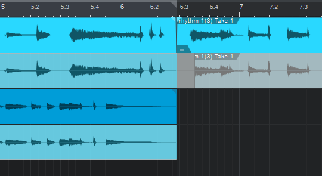

To record a new solo, mute and disarm your first solo track. Then hit T and repeat the recording procedure with the new track 

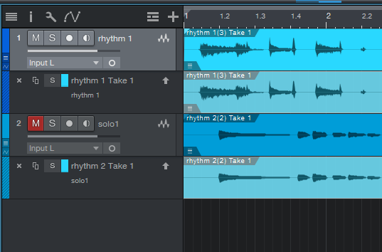

You can move tracks freely, change order and merge them. Very often you want to glue the tracks back to back without any gaps. If the program doesn’t detect you want to do that, you can do it manually: Select tracks by pressing Shift + click on tracks. Right click on a selected track, go to ‘Events’ and choose ‘Remove Gaps’

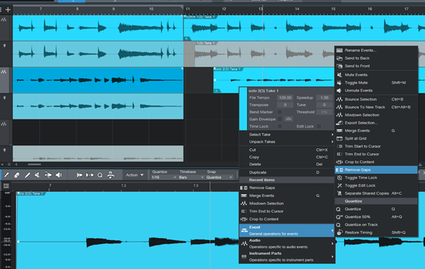

Now, the tracks should flow seamlessly from one to the other. You can also move the track freely up and down and it should keep the position. 

Remember, if something doesn’t work the way you want, the best option is Undo – Control + Z. Conversely, if you are happy with the results – save them with Control + S.

