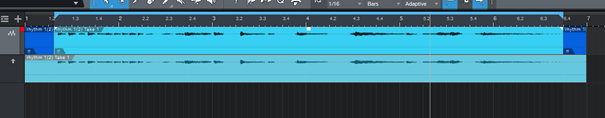
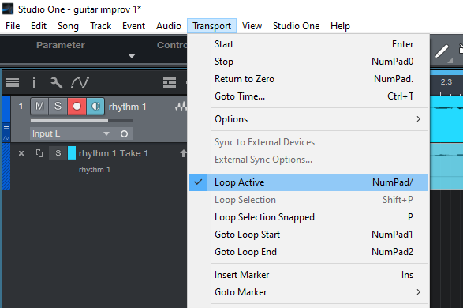
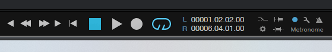
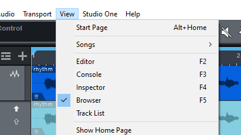
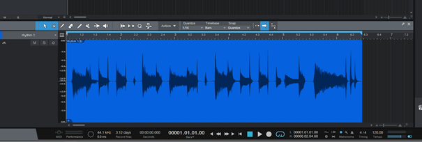

## **Looping a recorded track in Studio One 5**

To loop, you can select the whole recorded track or a selection of it – to do that hover over the track and click + drag the selection

 

Then go to Transport, choose Loop Active

 

Click on the loop and hit play to hear the looped selection

 

Your loop may need some cropping. To see the track better go to View and choose Editor or hit F2

 

A strip will pop up. I usually cut the end trails and sometimes the beginning. To do that, simply point and drag the cursor on the part you want to remove, right click and choose Delete

  

The loop is now set and can serve as a backing track for improvisation/solo tracks

