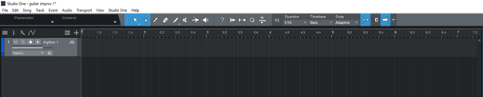

## **Recording a new track in Studio One 5**

Start with an empty song. You can choose one of the templates provided by the program 

 

You will be taken to the main screen - this is your command center

 

Time to add the first track. Press T or navigate the top menu: Go to Track > Add Tracks 

 

Now the track populates your main screen

 

To record anything on the track, you must arm it first. Hit the record button - it will change the color to red, which means it's armed now

 

You can also switch between mono and stereo recording. For now, leave it at mono

Click on the small dot at the bottom of the screen to enable precount. It will give you some time to grab the guitar after pressing record

 

Multiple takes can be recorded for each track

 

To preview your record, hit return, then play

 

