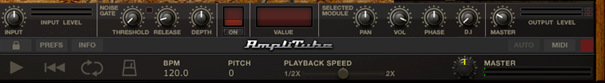
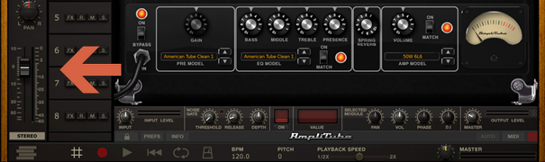
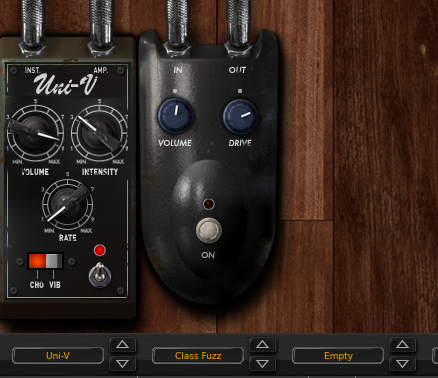
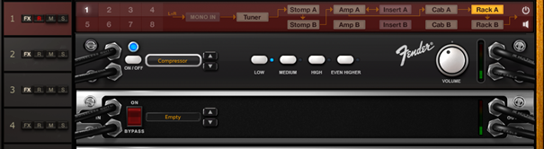
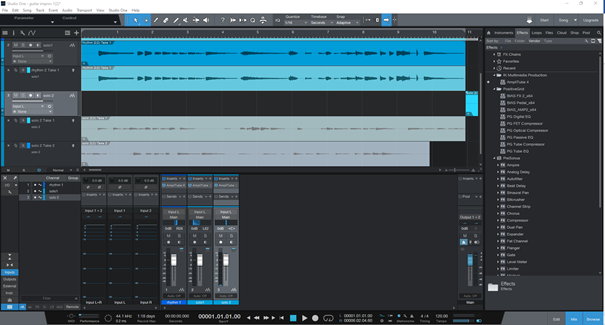
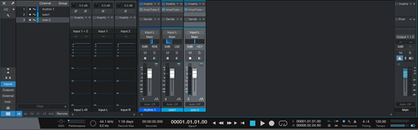
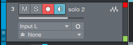
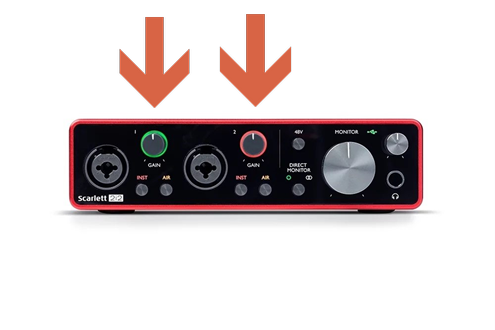
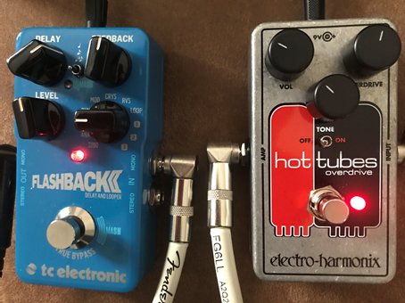
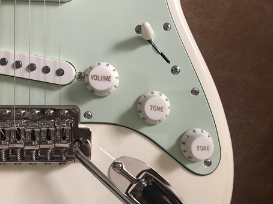

## **Signal level**

The signal coming from the instrument passes through multiple stages where its level can and should be controlled to prevent unwanted signal clipping, distortion and noise.

AmpliTube 4

This panel provides the most important volume controls: INPUT LEVEL placed on the left side and OUTPUT LEVEL placed on the right side

 

Amplifier panels in Amp A and B sections usually have at least one volume regulation, sometimes more

 

 Recorder section on the left side has a separate volume slider as well

 

Effects in Stomp A and B often have individual volume regulations

 

The same is true for effects in Insert A/B and Rack A/B

 

Studio One 5

The main view with a console window where the volume sliders reside

 

Console window, various input and output levels

 

Each track has a signal level monitor and a clipping indicator – it’s the red square in the upper right corner of the picture

 

 Additionally, every audio interface has its own volume regulations. I use Focusrite Scarlett 2i2 3gen which has separate volume regulators for each input

 

 What's more, most stompbox or external effects that you include in the signal chain will have separate volume regulations

 

Don't forget your guitar has one too!

 

Bottom line is you have to keep the instrument volume as loud as it can get to have the best signal to noise ratio but at the same time keep it in control to avoid clipping.

 

 

 

