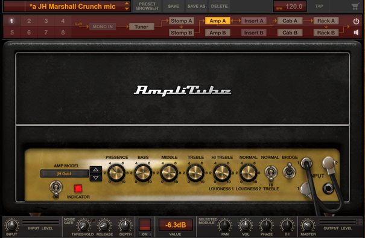
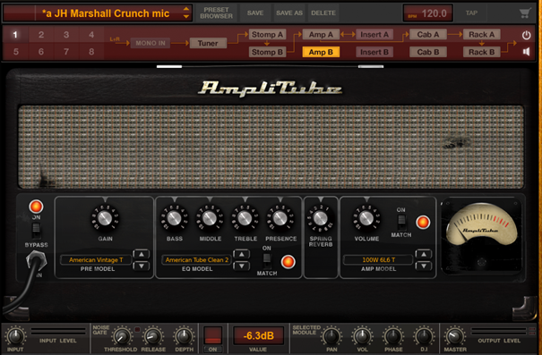
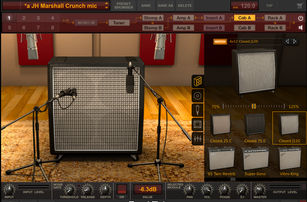
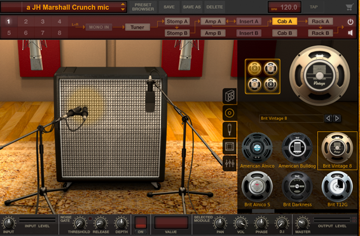
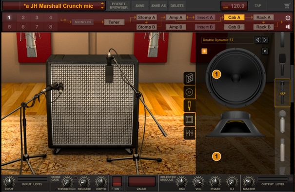
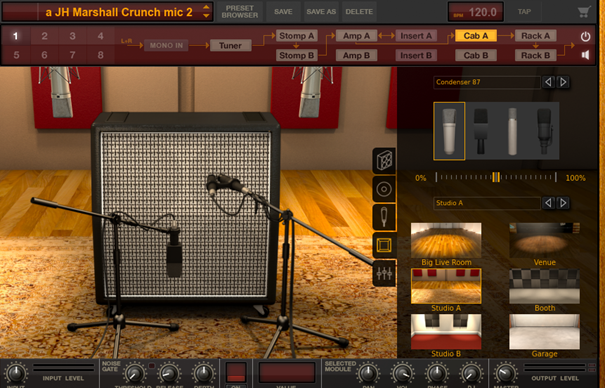
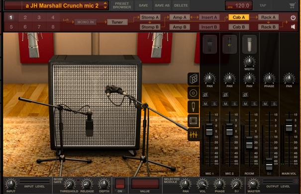
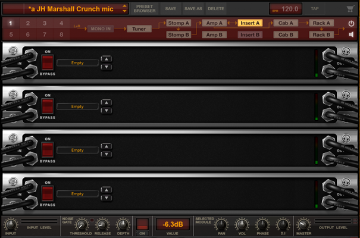
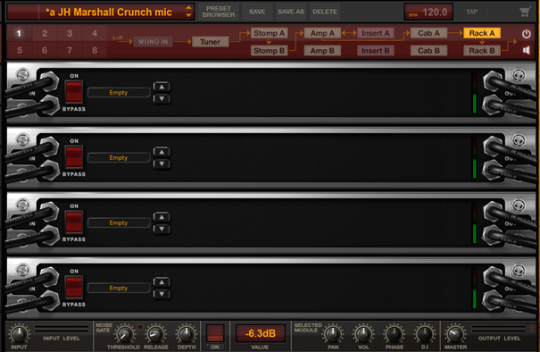
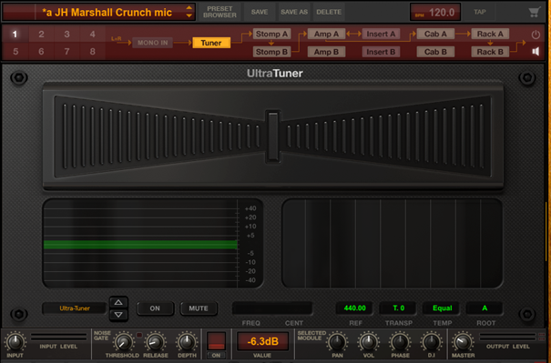

## **Choosing the amplifier, speaker cabinet and positioning the virtual microphones in AmpliTube 4**

Amp section. Similarly to the effect section, you can manipulate knobs and switches to change the sound. One amplifier for Amp A and one for Amp B. Bass amplifiers are also available

 

Some amp models let you choose different pre-amp, equalization and power amp modelling

 

Cab section. This is where the program shines. 
You can pick the cabinet model

 

It also lets you pick individual speakers to be placed in the cabinet – you can have four different speakers in one cab if you wish!

 

You also decide what microphones you want for your virtual cab and how they are positioned in relation to the speaker cones

 

You can also pick the type of recording room and the type and positioning of the room microphones

 

Plus, there is a separate mixer section for each microphone

 

I have to admit the cab section was the factor that convinced me to choose it over Positive Grid’s BIAS Amp 2 and FX 2 bundle and buy it

Other sections of the signal path are:
Insert A and Insert B which are placed between amp and cabinet to simulate an effect loop

 

Rack A and Rack B placed after cabinets and simulating rack units

 

and the tuner 

 

