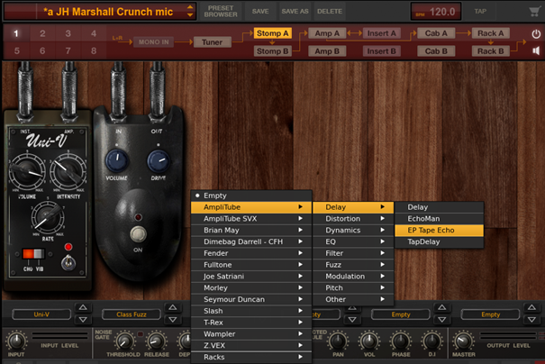

## **Creating a virtual chain of effects in AmpliTube4**

Let's model the sound of the instrument. Hit PRESET BROWSER to choose a pre-defined amp and effect preset or create your own preset

 

The easiest way to create your own preset is to choose a pre-defined one that generally fits your idea and modify it.

 

This top panel allows you to choose the virtual routing of your instrument signal. The paths are predefined 1 to 8 and the graph shows the path

 

This section displays your equipment slots 

 

At the bottom of it, there is a panel for controlling signal level. Here you can see that I reduced the master volume by -6.3dB to avoid signal clipping.

To access amp, cab or effect settings click on the corresponding section in the top panel graph

Effects section. You can adjust individual effect settings by manipulating knobs and switches

 

There are six effect slots available for Stomp A and six for Stomp B. You can pick an effect from the pop up list. The program offers a broad selection of them.

 

