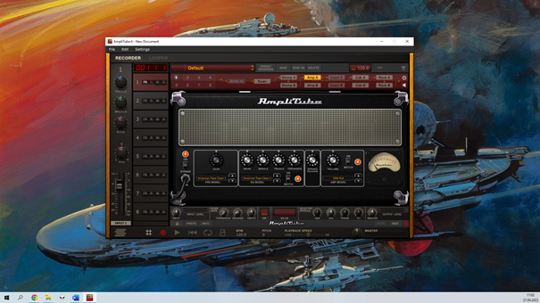

## **How to set up a VST plug-in - AmpliTube 4**

AmpliTube 4 opens only in a window mode, fullscreen is not available. The window can’t be maximized or even adjusted, no matter what version of the program you have. A monitor with a large screen is recommended.

