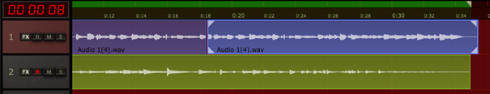
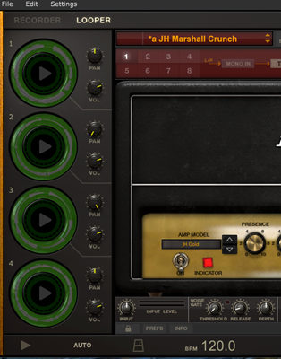

## **Recorder and looper - additional tools in AmpliTube 4**

Recorder and Looper are useful bonus tools for recording tracks

Recorder has eight tracks available with panning and basic EQ for each. You can change the position of each track by dragging it across the grid. You can easily loop a selection and record a solo track over the looped playback, duplicate selected tracks and then export your creation to a .wav file

 

This section lets you switch between the track view and the amp/effect section. Here, you can also toggle snap to grid as well as loop.

 

Each track can be armed with R, muted with M, soloed with S and modded with FX which are set in the amp/effect section

 

The green bar at the top shows the loop selection. You can drag it to the desired length

 

Recorder also lets you play various track setings together, you can play up to eight track sttings simultaneously. 

 

Arm the tracks you want with R and choose correct input – in my case Input 1 or Stereo mode for each track

 

Looper allows to record 15-second tracks. It has four loops available with separate volume and panning for each. The recorded loop mix can be exported to a .wav file

 

